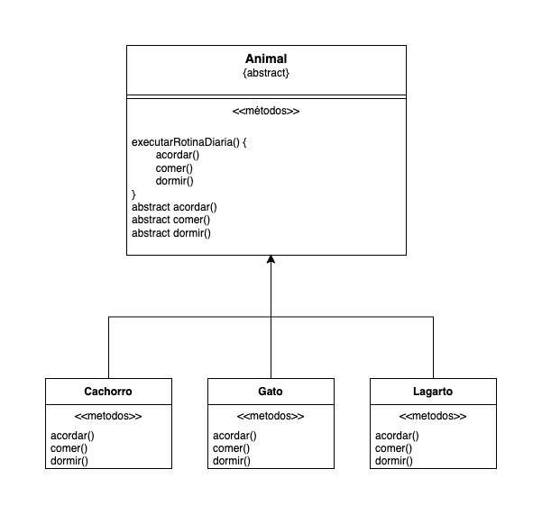

# Template Method

## Descrição

O padrão de projeto Template Method é um padrão comportamental que permite definir a estrutura geral de um algoritmo, deixando que subclasses especifiquem certas etapas do algoritmo sem alterar a estrutura em si. O padrão utiliza um método principal, chamado de "template method", que define a sequência de passos a serem seguidos, e métodos abstratos ou concretos que podem ser implementados de forma personalizada pelas subclasses.

O objetivo do padrão Template Method é fornecer um esqueleto para a execução de um algoritmo, permitindo que diferentes implementações possam ser definidas para partes específicas do algoritmo. Isso promove a reutilização de código e facilita a extensão do algoritmo sem precisar modificá-lo.

## Quando é usado?
O padrão Template Method é comumente utilizado quando se deseja definir um algoritmo genérico com etapas predefinidas, mas com partes do algoritmo que podem variar entre diferentes subclasses. Isso ocorre quando temos uma estrutura comum, mas comportamentos específicos que podem ser personalizados.

Algumas situações em que o padrão Template Method pode ser aplicado incluem:

- Quando se deseja implementar um algoritmo que possui uma estrutura fixa, mas com etapas que podem variar de acordo com o contexto.
- Quando se deseja evitar a duplicação de código ao lidar com algoritmos similares.
- Quando se deseja permitir que as subclasses forneçam implementações específicas para certas partes do algoritmo.

## Estrutura
O padrão Template Method envolve as seguintes entidades principais:

**Classe Abstrata** (AbstractClass): Define o esqueleto do algoritmo e declara os métodos que representam as etapas individuais do algoritmo. Pode conter métodos concretos, abstratos e métodos de gancho (hook methods) que podem ser sobrescritos pelas subclasses.

**Subclasses Concretas** (ConcreteClasses): Implementam as etapas específicas do algoritmo que são definidas na classe abstrata. Essas subclasses fornecem a personalização necessária para cada etapa do algoritmo.

## Relações com outros padrões
O padrão Template Method possui relações com outros padrões de projeto, incluindo:

- Padrão Strategy: O Template Method define a estrutura geral do algoritmo e delega partes específicas para métodos abstratos ou concretos. Esses métodos específicos podem ser vistos como estratégias diferentes que podem ser trocadas dinamicamente. Assim, o padrão Template Method pode ser combinado com o padrão Strategy para permitir uma maior flexibilidade na definição do comportamento do algoritmo.

- Padrão Factory Method: O Template Method pode ser utilizado em conjunto com o Factory Method para fornecer uma estrutura genérica para a criação de objetos. O Template Method define a sequência de passos para criar um objeto, enquanto o Factory Method é responsável pela criação específica do objeto em cada etapa do template method.

## Exemplo

Temos a classe **Animal**, com os métodos abstratos **acordar, comer e dormir**; também, o método template da classe, **executarRotinaDiaria**.
A subclasse irá extender a classe **Animal** e adicionar a implementação dos métodos abstratos.
Quando formos instanciar uma subclasse, só precisaremos chamar o método **executarRotinaDiaria**, que chama a implementação dos métodos abstratos da classe **Animal**.

No projeto, existem dois códigos, um que utiliza o padrão de projeto template method e outro que não utiliza.
 - Com padrão: [Clique Aqui](./src/com_template_method)
 - Sem padrão: [Clique Aqui](./src/sem_template_method)

## Vantagens
 - Reutilização de código
 - Facilita a manutenção
 - Promove o princípio do Open-Closed
 - Flexibilidade

## Desvantagens
 - Rigidez na estrutura
 - Dificuldade na compreensão
 - Aumento da complexidade hierárquica
 - Dificuldade em lidar com variações múltiplas
 - Acoplamento entre a classe base e subclasses
